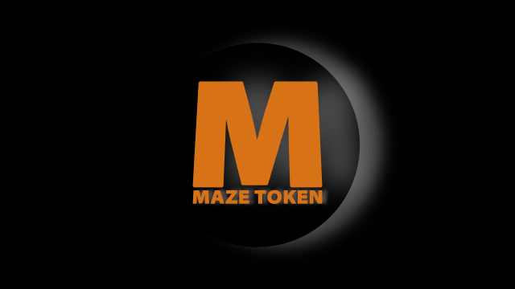

# MAZE

MAZE is a mineable (proof-of-work) appreciation token created on Bitcoin Cash (BCH) blockchain as peer-to-peer virtual asset.

The token operates without a central issuer and without a centralized promotion or sales developement.

No premine.

No presale.

No initial offering.

Decentralized distribution.

MAZE token is for creative people and can be used in a permissionless way. The token is a tradable asset, but it is not used to raise capital. There is no expectation of profit. MAZE purpose is to leverage the creative community as the token utility.

_Let`s create !_

_You do not need to follow one path. Explore unknown. Find what is hidden._

[MAZE icon on IPFS](https://gateway.pinata.cloud/ipfs/QmQtFFtwBfzNN5xjR4K7o8yiudK4FPhWMcsRM6pMg7WXFf)

----------------------------------------------------------------------------------------------

### MAZE - Bitcoin Cash [SmartBCH](https://smartbch.org/) SEP20 token

MAZE SEP20 token was created August 31, 2021. This is a mineable token based on [0xBitcoin](https://0xbitcoin.org/#/) contract.

MAZE SEP20 contract id: 0x481de06dca0198844faa36fca04db364e5c2f86c

Name: MAZE

Symbol: MAZE

Initial supply: 0

Max total supply: 21000000

Decimals: 6

[Blockchain explorer](https://www.smartscan.cash/address/0x481de06dca0198844faa36fca04db364e5c2f86c)

MAZE mining - [smartMaze](https://github.com/mazetoken/smartMaze)

Exchange - [MISTswap](https://mistswap.fi)

Exchange - [BenSwap](https://benswap.cash)

Interact with [MAZE SEP20](https://oneclickdapp.com/email-cosmos) SmartBCH contract.

[Chart](https://www.marketcap.cash/token/MAZE) - MarketCap

----------------------------------------------------------------------------------------------

### MAZE - Bitcoin Cash [Simple Ledger Protocol](https://simpleledger.cash/) token

MAZE SLP token was created July 22, 2020. This is a mineable SLP token Type-1 based on [Mist](https://github.com/mazetoken/mminer/blob/main/Mistcoin-archive/Mistcoin.md) covenant contract.

MAZE SLP token id: 553ac2ac7af0fcd4f24f9dfacc7f925bfb1446c6e18c7966db95a8d50fb378

Name: MAZE

Symbol: MAZE

Initial supply: 0

Max total supply: 21000000

Decimals: 6

[Blockchain explorer](https://simpleledger.info/token/bb553ac2ac7af0fcd4f24f9dfacc7f925bfb1446c6e18c7966db95a8d50fb378)

MAZE mining - [Mminer](https://mazetoken.github.io/mminer) - [Source code](https://github.com/mazetoken/mminer)

[Exchange](https://memo.cash/token/bb553ac2ac7af0fcd4f24f9dfacc7f925bfb1446c6e18c7966db95a8d50fb378?for-sale) - Memo

----------------------------------------------------------------------------------------------

### MAZE Token Underworld

[VANDALS](https://mazetoken.github.io/vandals) - SmartBCH token - [Source code](https://github.com/mazetoken/mazetoken.github.io/vandals) - [Website](https://vandalstoken.onuniverse.com)

[ZOMBIE](https://mazetoken.github.io/zombie) - just ZOMBIE token - [Source code](https://github.com/mazetoken/zombie) - [Website](https://zombies.onuniverse.com)

[COOL](https://github.com/mazetoken/cooltoken) - another mineable SmartBCH SEP20 token.

[TORPEDO NFT](https://mazetoken.github.io/torpedoNFT) - SmartBCH NFT.

[GHOST ON-CHAIN NFT](https://mazetoken.github.io/ghost) - SmartBCH NFT on-chain artwork (experimental).

[MAZE NFT](https://simpleledger.info/token/8678ad8c66cdcbdbb6e8f610fda055458b096c0f09a7fb6a18fe098343411f21) - the first mineable SLP NFT Group token.

MAZE [Post Office](https://mazepostage.herokuapp.com/) - SLP postage (send MAZE and other SLP tokens without BCH transactions fee).

[SLP smart contract tokens](https://github.com/mazetoken/SLP-smart-contract-tokens) REBEL, VANDALS, CARTEL trilogy - cashscript SLP tokens (mintable, decentralized)

dSLP - decentralized SLP, BHACK - Blind Hackers Group - another mineable SLP tokens Type 1.

----------------------------------------------------------------------------------------------

## Community projects

[sVNT farm MAZE 1](https://svntfarm.netlify.app/farms/xMAZE-BCH) - MISTSwap LP - farm MAZE token and get sVNT token

[sVNT farm MAZE 2](https://svntfarm.netlify.app/farms/MAZE-BCH) - BenSwap LP - farm MAZE token and get sVNT token

----------------------------------------------------------------------------------------------

## Disclaimer

This is not an investment advice or recommendation. This is for information purposes only. Use it at your own risk and do your own research.

Interacting with cryptocurrency virtual assets always check a token/contract id.

In general, cryptocurrencies might be volatile and speculative assets.

_MAZE token creator (B_S_Z) should not be considered as Virtual Asset Service Provider and does not provide any "initial offerings", "investing plans", "dividends", "staking rewards" or other "promises"._

_MAZE token should not be considered as financial instrument (according to MiFID directives) or security (the legal definition of a security varies by jurisdiction)._

----------------------------------------------------------------------------------------------

## Social

[Telegram](https://t.me/mazetokens)

[Github](https://github.com/mazetoken)

email: mazetoken@mail2tor.com

SmartBCH [Tools and Resources](https://mazetoken.github.io/smartBCH-resources)

----------------------------------------------------------------------------------------------